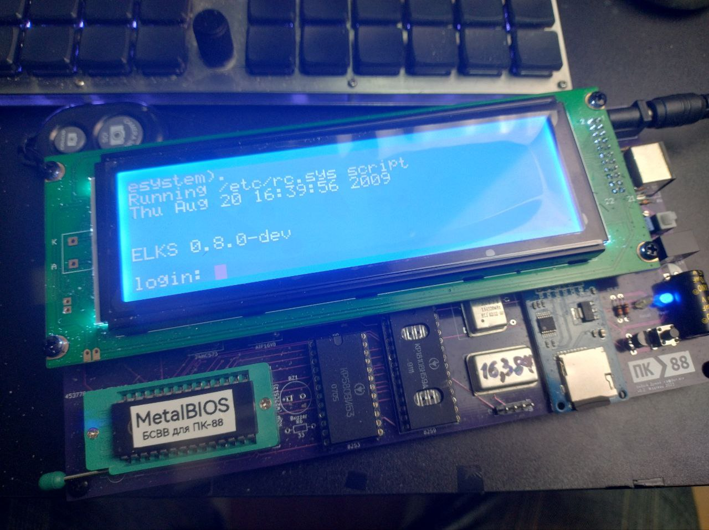

# PK88

Single-board computer based on KM1810VM88 CPU (Ukrainian clone of Intel 8088) that can run ELKS!

PK stands for Персональний Комп'ютер ("Personalnii Kompyuter", i.e. "Personal Computer") in Ukrainian.

- [KiCad schematics](./kicad)
- [GAL sources](./gal) - Address & I/O port decoders using 2x ATF16V8
- [Various circuit simulations](./circuits) - made with [Digital](https://github.com/hneemann/Digital)
- [MetalBIOS](./metalbios) - IBM PC XT compatible-ish BIOS that I made specifically for PK-88

## Resources

- 8088/x86 instruction set: <https://zsmith.co/intel.php>
- Zen of Assembly language (including 8088 instruction set): <http://www.jagregory.com/abrash-zen-of-asm/>
- Soviet IC series differences: <http://vozom.ho.ua/R4/page21.html>
- IBM PC technical reference: <http://bitsavers.informatik.uni-stuttgart.de/pdf/ibm/pc/at/6183355_PC_AT_Technical_Reference_Mar86.pdf>
